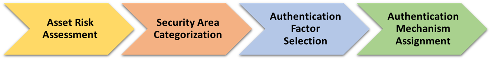

In order to determine how many factors of authentication are required, a risk analysis should be conducted for each access point (door). The diagram below outlines the multi-step process for selecting which mechanism to use for authentication.  At a minimum, the process includes four steps:

{:style="width:80%;float:center;"}

**Figure 1. Authentication Mechanism Selection Process**

**1. Asset Risk Assessment.** The first step is to evaluate the likelihood and effect of losing or compromising each asset within a security area. If the likelihood is high or the impact is substantial, then categorize the risk to that asset as HIGH.  Other assets may have LOW or MODERATE risk.

**2. Security Area Categorization.**  Next, assign to the security area the same risk level as the highest risk asset within the area.  For example, say there are three assets within a designated security area:  a LOW-risk asset, a MODERATE-risk asset, and a HIGH-risk asset.  The security area must be classified as a HIGH-risk security area.  As an alternative, split the security area into separate security areas, or a set of embedded security areas, each with a different risk categorization.

NIST SP 800-116 adopts the security area categorizations described in Field Manual 3-19.30, _Physical Security. Headquarters, Department of the Army, United States of America_ (8 January 2001). <!--FM 3-19-30 is no longer listed as in effect by the Army. See http://usacac.army.mil/sites/default/files/misc/doctrine/CDG/fms.html for active listing of FMs.-->The manual defines three security area categories: Exclusion, Limited, and Controlled. The categories distinguish how immediately accessible the security assets (or security interests) are within the security area. (See Table 1.)  

**Table 1.  Security Area Categories**

| **Category** | **Description**  |
| :----------- | :-------------------------------     |
| **Controlled**  |  An area close to or surrounding a limited or exclusion area.  Entry to a controlled area is restricted to personnel who need access.  Movement of authorized personnel within this area is not necessarily controlled, since entry to the area does not provide immediate access to any security assets or interests.  A controlled area provides administrative control, or safety, or acts as a buffer zone for embedded limited or exclusion areas. |  
| **Limited**   | An area close to a security asset or interest.  Uncontrolled movement within a limited area may permit access to the asset.  Escorts and other internal restrictions can prevent access. |  
| **Exclusion**   | An area in which uncontrolled movement would permit direct access to a security asset or interest. |  

You can also define your own categorizations to reflect your particular security needs and/or physical security policies and practices.

**3. Authentication Factor Selection.** The guidelines that govern the types and number of factors required to authenticate people and their credentials for specific security area classifications are straightforward.  Authentication is based on verifying one, two, or three of the following factors:

- Something you have (e.g., a PIV card)
- Something you know (e.g., a PIN)
- Something you are (e.g., a fingerprint or iris scan)

NIST SP 800-116 recommends the minimum number of authentication factors required to access controlled, limited, and exclusion areas. (See Table 2.)

**Table 2. Number of Required Authentication Factors**    

| **Security Area** | **Minimum No. Required Authentication Factors** |
| :----------- | :-------------------------------: |
| **Controlled**  |  1 |  
| **Limited**   | 2 |  
| **Exclusion**   | 3 |  
  

**4. Authentication Mechanism Assignment.**  Once you know how many authentication factors are required for a security area, you can determine the appropriate authentication mechanisms.  NIST SP 800-116 describes available authentication mechanisms and provides guidance on how they can be applied.  But you can choose to deviate from the NIST SP 800-116 recommended authentication mechanisms and select solutions that fit your particular agency’s needs.

## What Authentication Mechanisms Are Available?

PIV and PIV-I cards are provisioned (encoded) with both identifiers and cryptographic data objects that can be used to support authentication. Identifiers can include a Federal Agency Smart Credential Number (FASC-N) and Global Unique ID (GUID); data objects can be public and private keys or digital certificates.  FIPS 201<!--Should reference FIPS 201-2--> and NIST SP 800-116 list the following electronic authentication methods using the PIV card:

- PKI authentication using the PIV Authentication Certificate (PKI-AUTH)
- PKI authentication using the Card Authentication Certificate (PKI-CAK)
- Authentication using the Symmetric Card Authentication Key (SYM-CAK)
- Unattended authentication using off-card biometric comparisons (BIO)
- Attended authentication using off-card biometric comparisons (BIO-A)
- Either attended or unattended authentication using off-card biometric comparisons (BIO(-A))
- Authentication using on-card biometric comparisons (OCC-AUTH)

FIPS 201 and NIST SP 800-116 exclude automated Card Holder Unique Identifier (CHUID) authentication and visual inspection of the PIV card because they offer little or no authentication assurance for access control.

Table 3 lists the candidate authentication mechanisms for each of the three security area categories.

**Table 3. Candidate Authentication Mechanisms**

| **Category**  | **No. Factors Required** | **Acceptable Factors** | **PIV Mechanism: Contact Interface**  |  **PIV Mechanism: Contactless Interface** |
| :-------- | :------: | :----- | :-----  | :-----     |
| **Controlled**   | 1 | Something you have OR Something you know OR Something you are  |  PKI-CAK SYM-CAK BIO  | PKI-CAK  SYM-CAK   |
| **Limited**   | 2 |Something you have AND something you know, OR Something you have AND something you are, OR Something you know AND something you are  | PKI-AUTH, BIO-A,  OCC-AUTH  |  |
| **Exclusion**  | 3 | Something you have AND something you know AND something you are | PKI-CAK + BIO(-A), SYM-CAK + BIO(-A)  |   |

When using SYM-CAK, PKI-CAK, and PKI-AUTH authentication mechanisms, certificates should be validated when possible. Verify the certificate against a certificate revocation list (CRL) or online certificate status protocol (OCSP) server, and verify the origin of the certificate through the trust chain of issuing certificate authorities to the root certificate authority, using certificate path validation.

## What Do I Need in My Site/Agency?

Use the following checklist to guide PACS policy, planning, and technical implementation when you are going to implement an approved, PIV-enabled PACS.

- Consider an agency-wide “enterprise PACS” approach, and designate a chief PACS officer to define agency-specific PACS policies and oversee the implementation of the enterprise PACS solution.
- Review PIV-related Office of Management and Budget and agency policies:&nbsp;&nbsp;OMB M-06-18 and OMB M-11-11. <!--Standards and Policies identifiers and reference information has been moved to Standards and Policies section.-->
- Review PACS standards and guidance:&nbsp;&nbsp;NIST SP 800-116-1<**800-116-1 is a Draft**>; _Federal Identity, Credential, and Access Management (FICAM) Roadmap and Implementation Guidance_; and _PIV in Enterprise Physical Access Control Systems (E-PACS)_.
- Review current and new or planned PACS installations. Agency PACS that are currently using non-PIV tokens must be replaced or upgraded to use PIV cards for authentication.
> Current agency PACS based on a PIV CHUID authentication must be upgraded to use the candidate authentication mechanisms.
> New agency PACS must be PIV-enabled, using the candidate authentication mechanisms. 
- Implement a common procurement process and purchase approved PACS systems and equipment from the GSA Approved Products List (APL).

### Technical implementation

* Decide whether the PACS back-end system should be Cloud-based or local.
* Determine the security area category for each access point.
* Select the authentication mechanism to be used at each access point’s PIV card reader.
* Consider a PACS with external connections to validate PIV digital certificates using an external certificate revocation list or online certificate status protocol services and certificate path validation.
